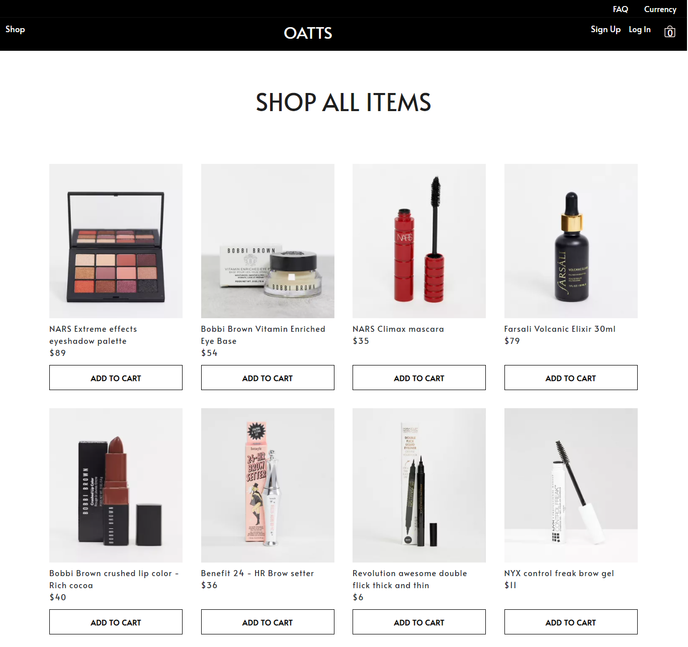

## React Ecommerce Application

### Description
A full beauty ecommerce website application built from scratch.

---

### Technologies

* React
* Redux
* SASS
* Bootstrap
* Firebase

---

### Live Link

https://oatts-ecommerce.netlify.app/

---

### Project Description

* A user can shop for makeup and beauty products via shop link or showcase links.
* On adding items to cart, the user can either login or create an account via email, google or continue shopping as a guest. This feature is enabled using firebase authentication.

* Multiple users can access the site at thesame time a user can add and update items in the cart. This feature is enabled using firebase cloud firestore to store users information in the database. 
* User authentication, information and cart component state is managed using redux.
* User can proceed to checkout and make payment using a credit or debit card with the implementation of stripe.

---

### In Development

* Context and Nodejs versions

---

### Credit
Images
* [Asos Face and Body- MakeUp](https://www.asos.com/women/face-body/makeup/cat/?cid=5020&nlid=ww|face+%2B+body|shop+by+product)
* [Asos Face and Body- Skin Care](https://www.asos.com/women/face-body/skin-care/cat/?cid=4540&nlid=ww|face+%2B+body|shop+by+product)
* [Unsplash- beauty products](https://unsplash.com)

---

This project was bootstrapped with [Create React App](https://github.com/facebook/create-react-app).

## Available Scripts

In the project directory, you can run:

### `npm start`

### `npm test`

### `npm run build`

### `npm run eject`

